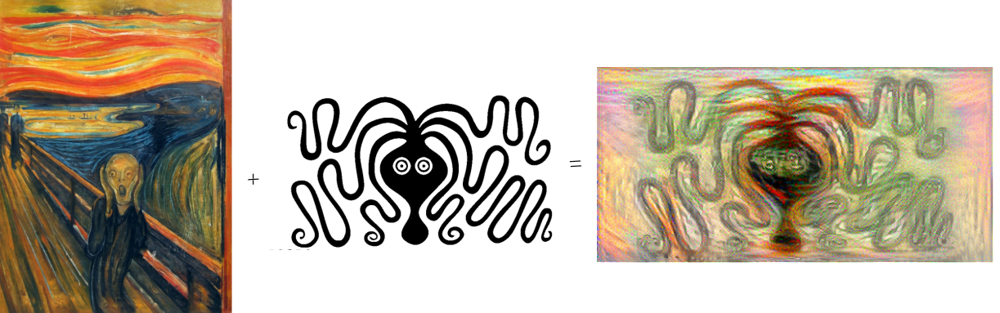
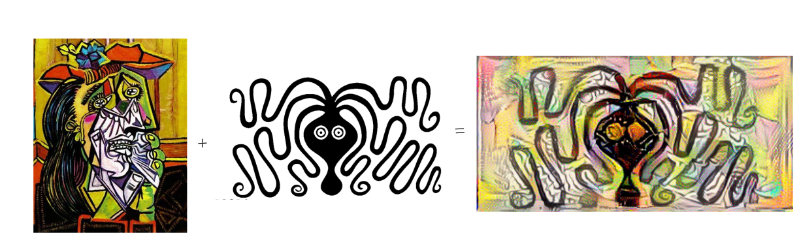
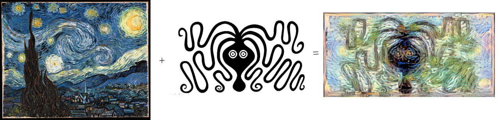

# -Brushstrokes-of-Code 🖌️
Transforming Images with Neural Style Transfer

## Overview

This project implements Neural Style Transfer (NST) using TensorFlow and the VGG19 convolutional neural network. The NST technique allows you to blend the content of one image with the artistic style of another. This README provides a detailed guide on how to use the code provided in the notebook.

## Key Features
- Load and preprocess content and style images.
- Extract features using the VGG19 model.
- Compute content and style losses.
- Perform gradient descent to generate a stylized image.
- Display the resulting image.


## Usage

### Upload Images
Before running the style transfer, you need to upload your content and style images. You can use the following code snippet to upload files directly to Colab:

```python
from google.colab import files

uploaded = files.upload()
```

### Set Image Paths
After uploading your images, set the `content_path` and `style_path variables` in the code to the names of the uploaded files:

```python
content_path = 'your_content_image.jpg'  # Change this to your content image name
style_path = 'your_style_image.jpg'      # Change this to your style image name
```

# Examples 🎨




